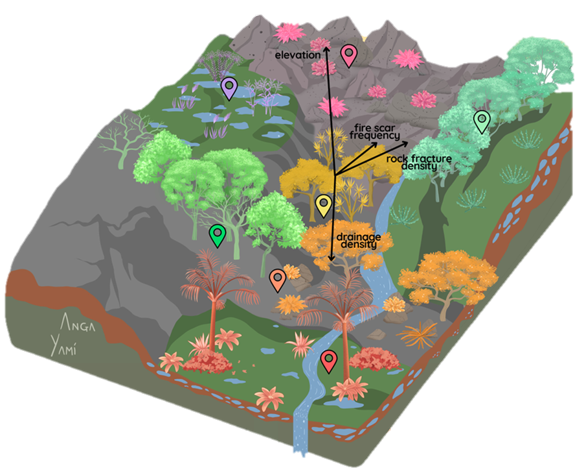

# espinhaco_fracture_networks
Fracture density interpretation of the Espinhaço Range Biosphere Reserve (ERBR) as a driver for floristic variation.

<br>


<br/>

## Reference
Viotti, J., Tanaka, A.P.B., Gripp, A., Costa, T., Gonzaga, A. (2025). Drivers of floristic variation in Cerrado–Atlantic Forest ecotones within the Espinhaço Range Biosphere Reserve. *75º Congresso Nacional de Botânica e 39ª Reunião Nordestina de Botânica*.

10.13140/RG.2.2.11369.61289/1

## Data description


### Files

In the "data" folder, you will find:

- Fracture network interpretation
  - Filename: `.shp`

## Dependencies

Use the package manager [pip](https://pip.pypa.io/en/stable/) to install the following packages.

```bash
pip install matplotlib numpy scipy jupyter-notebook
```


